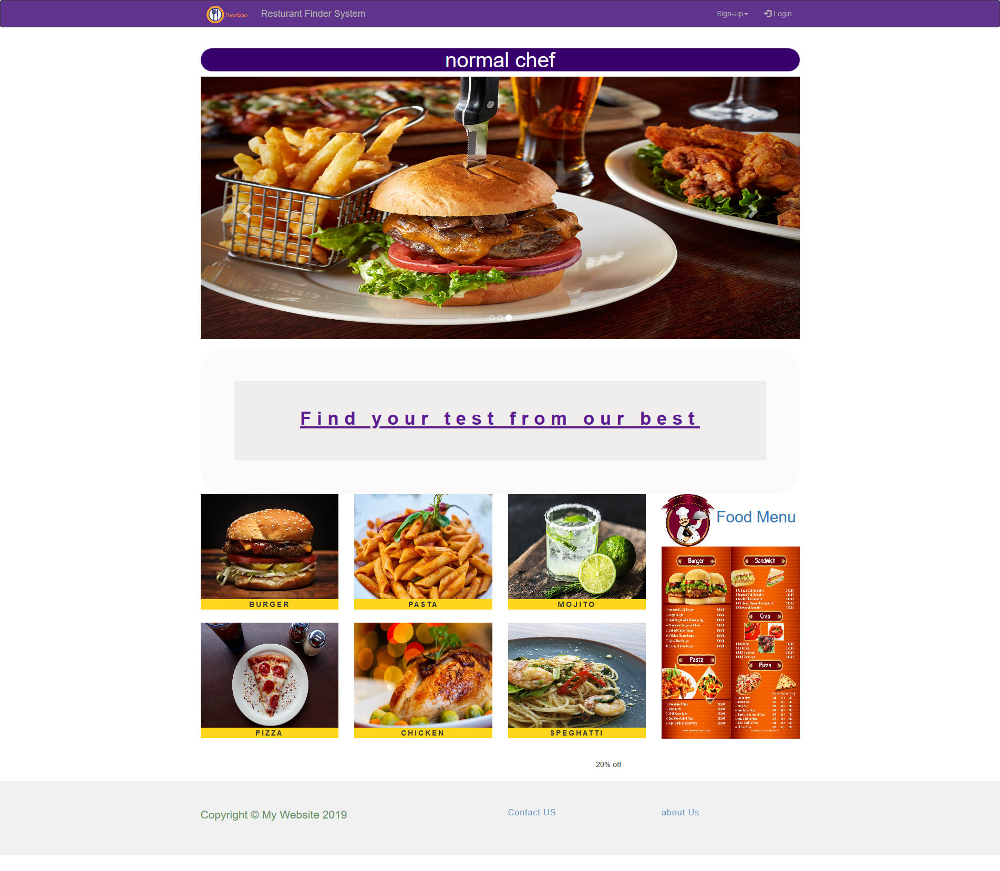
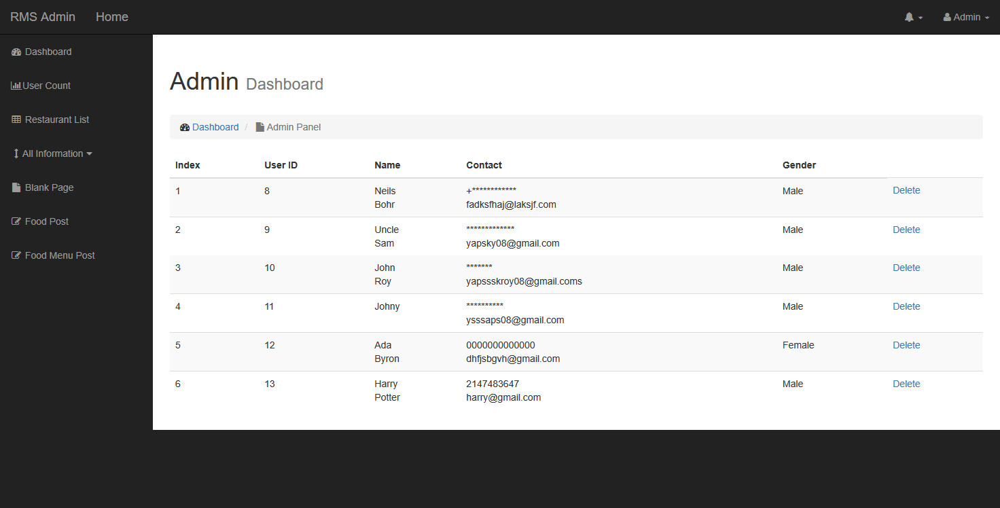

# Restaurant-Finding-System

> Web based Restaurant Finder System


## Using Tools

> Front-end

- HTML5
- CSS3 
- BOOTSTRAP4

> Programming Language

- PHP7
- JavaScript

> Database

- MySql

## Features 

1. Responsive ( Compatible with any kind of screen size)
2. Interactive & Animated Restaurant Pages
3. Fully Dynamic Apllication
4. Multifunctional Admin Panel
5. Dynamic Google Map Searching
6. Multiple Searching Options

**PHP CODE SAMPLE**

> Single Section of Search Options

```HTML
	elseif ($r_names === $r_name && $food_prices !=="" && $food_names === "") {
		if ($food_price>=$food_prices) {
		// echo "restaurant name and food price search";
		echo "<tr>";
		echo "<td> <a href = 'restaurant_home.php?name=$r_name'>{$r_name}</a></td>";
		echo "<td>{$rating} <span class='fa fa-star checked'></span> </td>";
		echo "<td>{$r_address}</td>";
		// <span class="fa fa-star checked"></span>
		// <span class="fa fa-star checked"></span>
	  // <span class="fa fa-star checked"></span>
		// <span class="fa fa-star checked"></span>
	  // <span class="fa fa-star"></span>
		echo "</tr>";
		}
}
```

> Sample Restaurant Page



> Admin Panel Overview



 # Developers Team
 
 [Saikat Roy](https://github.com/njmsaikat)
 
 [Sadekur Rahman](https://github.com/Biplob14)
